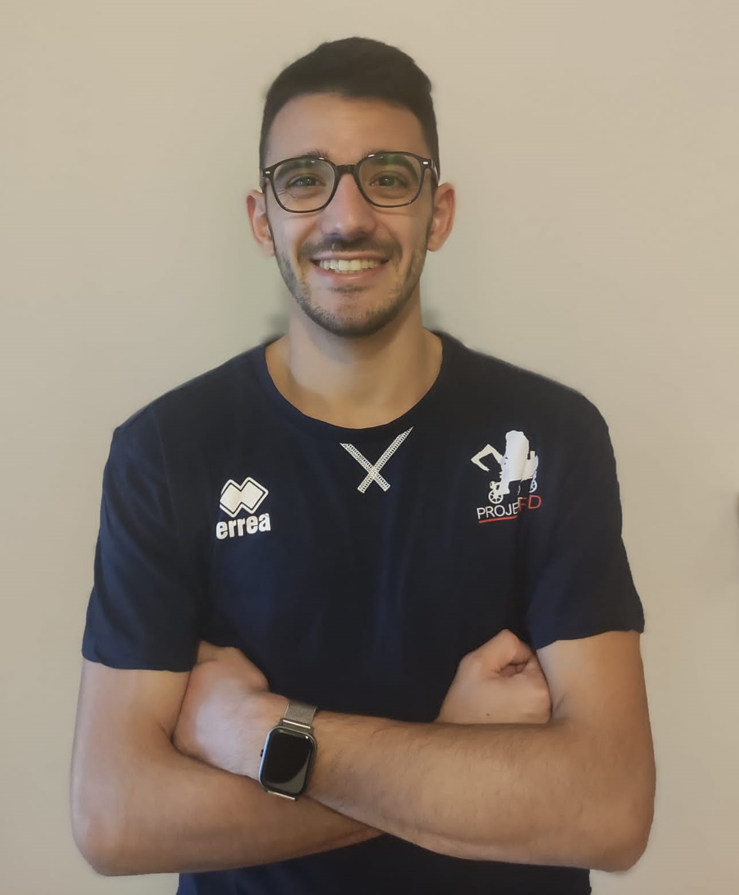

# 

  

[Linkedin Profile](linkedin.com/in/italo-almirante-62431a216)

# Bio

Hello! I'm **Italo Almirante**, a passionate control software developer, expert in Robotics & AI.
I'm a Research Fellow at the ARS Control Laboratory, Dismi, Unimore (see at [ARS Control Lab](https://www.dismi.unimore.it/it/ricerca/laboratori-di-ricerca/laboratorio-di-automazione-robotica-e-controllo-di-sistemi-arscontrol)).

I am a member of ProjectRED rover team (see at [ProjectRED](https://projectred.it/)), competing in the [European Rover Challenge](https://roverchallenge.eu/). Certifications available at [ERC Certifications](https://roverchallenge.eu/certificates/).  
My public projects (available at [GitHub Profile](https://github.com/Italo-99)).

# Projects
- [Grippers](https://github.com/Italo-99/gripper)
- [Cameras](https://github.com/Italo-99/cameras)
- [Cables detection](https://github.com/Italo-99/cables_detection)

# Papers
o [Simple Strategy for Torque Ripple Minimization in Switched Reluctance Motor Drives](https://doi.org/10.3390/en16196885)

# History
- **2021**
  - Bachelor's Degree in Mechatronics Engineering.
- **2022**
  - Participation to ERC 2022, competing in Remote and OnSite formulas. 3rd place Remote. My role: control software developer of microcontrollers and robotic platform.
- **2023**
  - Publishing first paper, "Simple Strategy for Torque Ripple Minimization in Switched Reluctance Motor Drives".
  - Participation to ERC 2023, competing in Remote and OnSite formulas. 3rd place Remote, 9th place OnSite. My role: Project Manager.
- **2024**
  - Master's Degree in Mechatronics Engineering.
  - Starting Research Fellow. My role: control software developer of human-robot interaction strategies.
