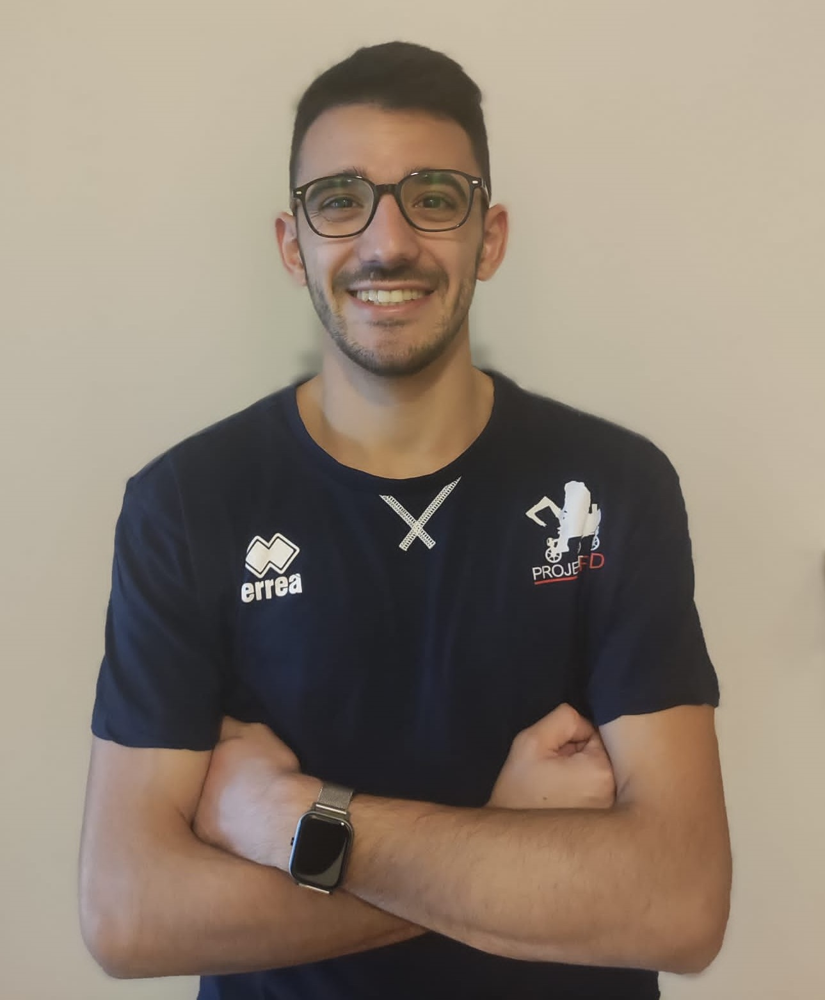
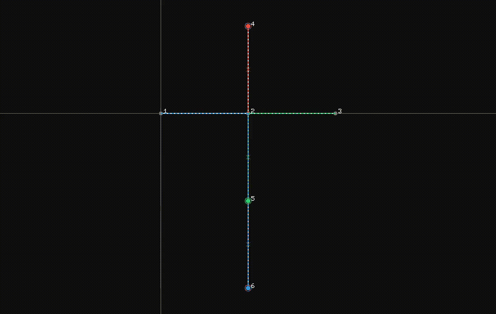
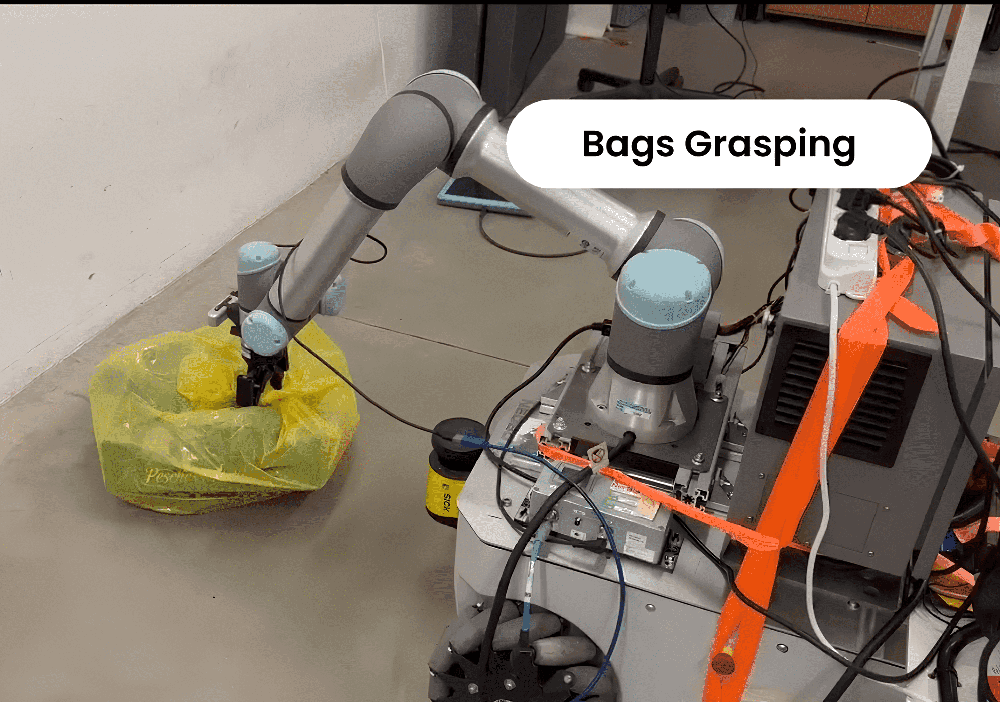
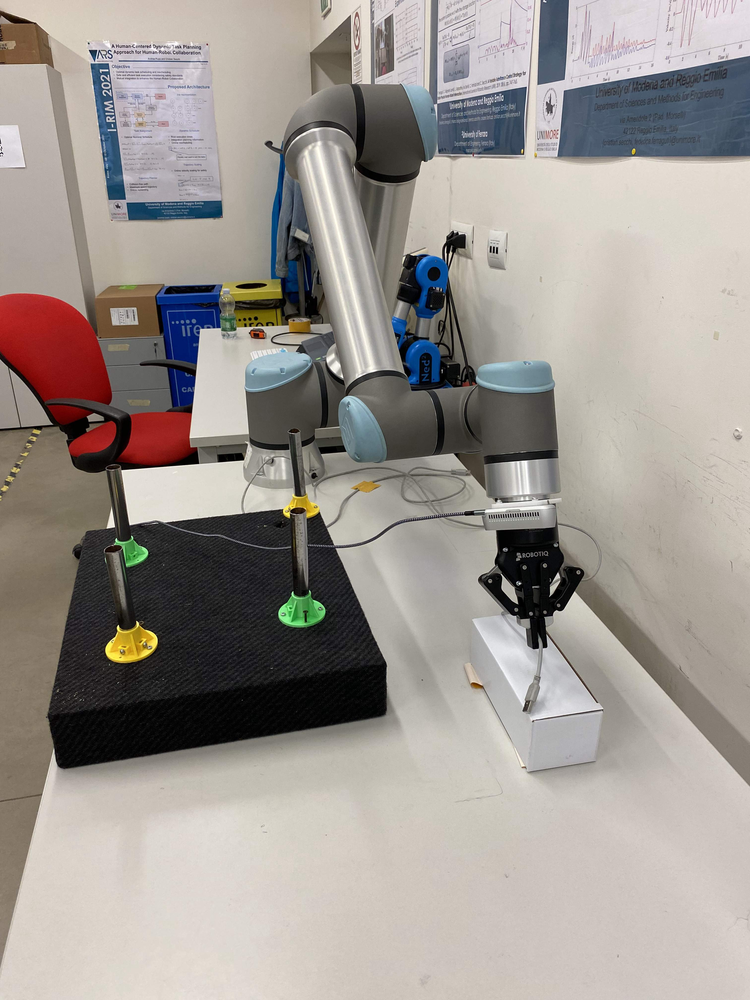
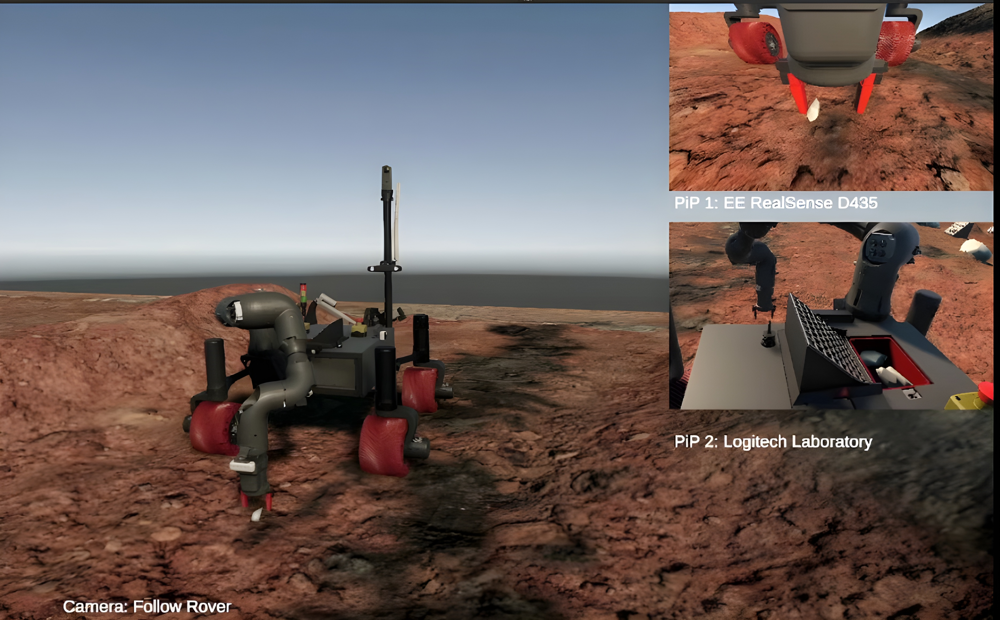
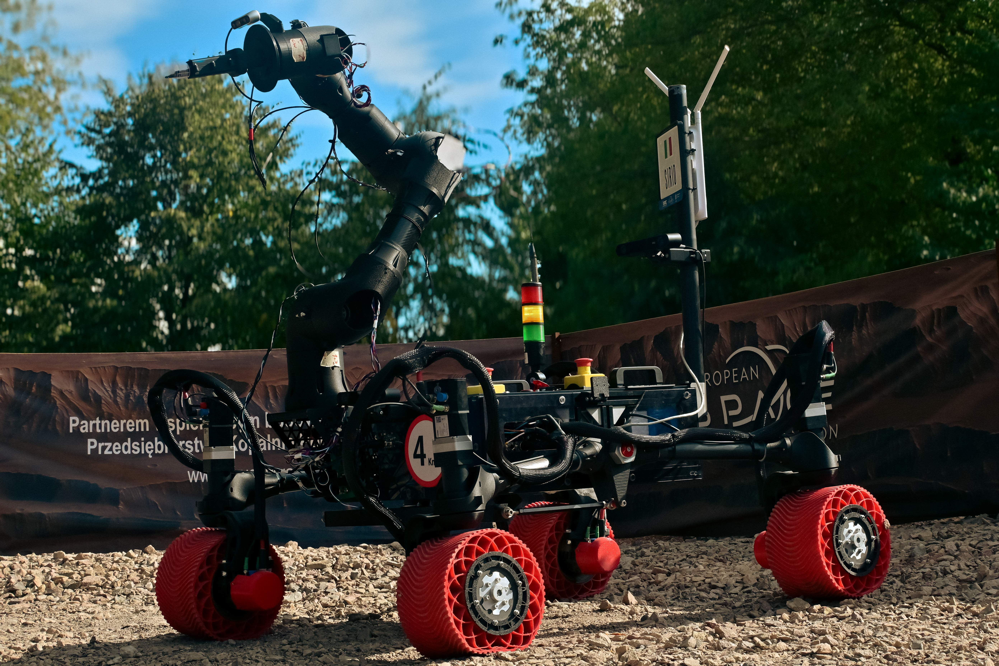
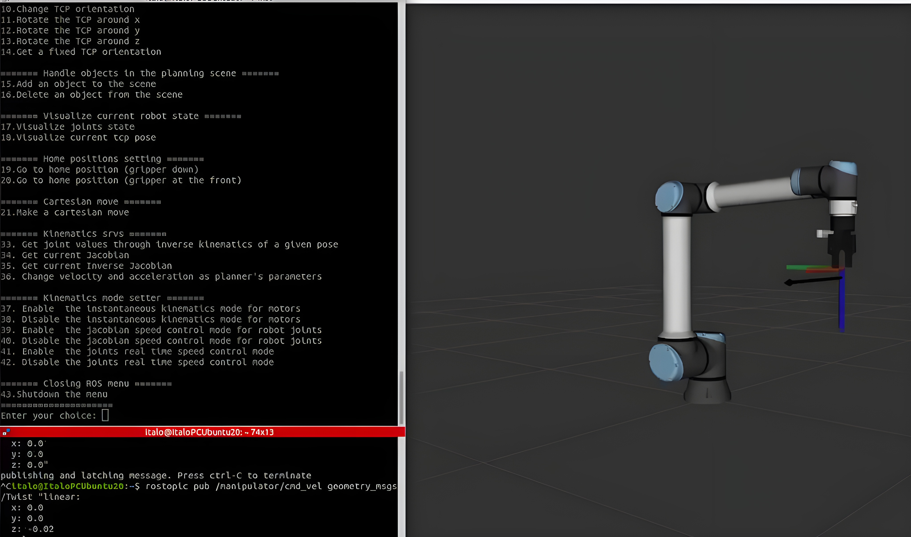

<!-- Home page (Italiano) -->

  <a class="button-link button-link-primary" href="./index.html">English</a>
  <a class="button-link" href="./progetti.html">Progetti</a>
  <a class="button-link" href="./novita.html">Novità</a>
  <a class="button-link" href="./pubblicazioni.html">Pubblicazioni</a>

<section class="hero-grid">
  

    <h1 class="hero-title">Italo Almirante</h1>
    
PhD Researcher in Robotics

    

      Progetto e sviluppo applicazioni per il controllo di sistemi robotici, dal controllo embedded e i layer di comunicazione fino a navigazione autonoma, manipolazione, simulazione e coordinamento del traffico multi-robot.
    

    

      Il mio lavoro comprende integrazione di sistema e ricerca sull'autonomia di robot industriali e outdoor, con particolare attenzione a coordinamento di flotte, mobile manipulation, e space robotics.
    

    

      <a class="button-link button-link-primary" href="./progetti.html">Esplora i progetti</a>
      <a class="button-link" href="./novita.html">Aggiornamenti</a>
    

  

  

    
  

</section>

## Di cosa mi occupo

  

    <h3>Autonomia multi-robot</h3>
    
Pianificazione scalabile, coordinamento di flotte e framework di simulazione per scenari logistici dinamici.

  

  

    <h3>Mobile manipulation</h3>
    
Manipolazione di oggetti deformabili guidata da: percezione 3D, interazione con controllo di forza e architetture software riusabili e modulari.

  

  

    <h3>Space robotics systems</h3>
    
Prototipi di rover autonomi, con bracci robotici e sottosistemi per l'analisi scientifica,
        l'esplorazione e la navigazione autonoma.

  

## Progetti in evidenza

  <a class="project-card" href="./it/mapf.html">
    
    

      
Ricerca

      <h3>Multi-Robot Planning</h3>
      
Framework in C++ e ROS2 per coordinamento di flotte e autonomia robusta.

    

  </a>

  <a class="project-card" href="./it/deformable.html#bags">
    
    

      
Ricerca

      <h3>Manipolazione di oggetti deformabili</h3>
      
Percezione, grasping, co-manipolazione e interazione con manipulatori mobili con controlli a feedback di forza.

    

  </a>

  <a class="project-card" href="./it/deformable.html#dlo">
    
    

      
Ricerca

      <h3>DLO Perception and Grasping</h3>
      
Segmentazione di cavi, stima della posa 3D, validazione in CoppeliaSim ed esecuzione sim-to-real.

    

  </a>

  <a class="project-card" href="./it/rover.html#navigation">
    

      
    

    

      
ProjectRED

      <h3>Navigazione autonoma e digital twin</h3>
      
Autonomous navigation, localizzazione, gestione ostacoli e workflow ROS2-Unity.

    

  </a>

  <a class="project-card" href="./it/rover.html#manipulation">
    

      
    

    

      
ProjectRED

      <h3>Braccio rover e sampling</h3>
      
Controllo del manipolatore, probing, deep sampling e integrazione di sottosistemi per applicazioni outdoor.

    

  </a>

  <a class="project-card" href="./it/manipulator-framework.html">
    

      
    

    

      
Software

      <h3>Manipulators Framework</h3>
      
Software riusabile per pianificazione e controllo di manipolatori commerciali e custom.

    

  </a>

## Profilo ingegneristico

<!-- 

  

    <strong>250+</strong>
    robot gestiti in simulazione warehouse
  

  

    <strong>&lt; 100 ms</strong>
    target di replanning in scenari dinamici
  

  

    <strong>Full stack</strong>
    embedded, controllo, percezione, planning, simulazione
  

 -->

  

    <h3>Domini principali</h3>
    <ul>
      <li>Coordinamento multi-agent e multi-robot</li>
      <li>Manipolazione robotica "soft"</li>
      <li>Navigazione autonoma e digital twin</li>
      <li>Robotica guidata da visione e AI</li>
    </ul>
  

  

    <h3>Strumenti principali</h3>
    <ul>
      <li>ROS1, ROS2, MoveIt, Nav2</li>
      <li>C++, Python, MATLAB, RobotStudio</li>
      <li>CoppeliaSim, Unity, Gazebo, MuJoCo</li>
      <li>RGB-D perception (RealSense, Zed2)</li>
      <li>Computer Vision (YOLO, SAM)</li>
      <li>Robotics platforms (Neobotics, MiR, UR)</li>
      <li>STM32, CAN, CANopen, USART/UART</li>
    </ul>
  

## Esplora il sito

  

    <h3><a href="./progetti.html">Progetti</a></h3>
    
Pagine dettagliate su ricerca, software e sistemi robotici integrati.

  

  

    <h3><a href="./pubblicazioni.html">Pubblicazioni</a></h3>
    
Una sezione oer articoli scientifici, output di ricerca e riferimenti tecnici.

  

  

    <h3><a href="./novita.html">Novità e aggiornamenti</a></h3>
    
Uno spazio dedicato a future news, milestone, opportunità e annunci.

  

---

## Link

  <a href="https://www.linkedin.com/in/italo-almirante-62431a216/">LinkedIn</a>
  <a href="https://github.com/Italo-99">GitHub</a>
  <a href="https://scholar.google.com/citations?user=Ap9R8foAAAAJ">Google Scholar</a>
  <a href="https://www.arscontrol.unimore.it/italo-almirante/">ARS Control Lab</a>
  <!-- <a href="https://projectred.it/">ProjectRED</a> -->
  <a href="https://www.dismi.unimore.it/it/didattica/progetti-gli-studenti/project-red">ProjectRED</a>

