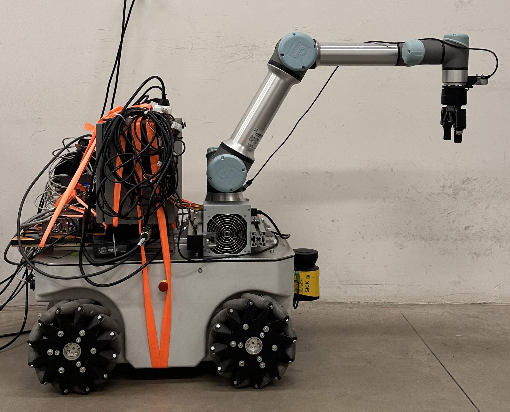
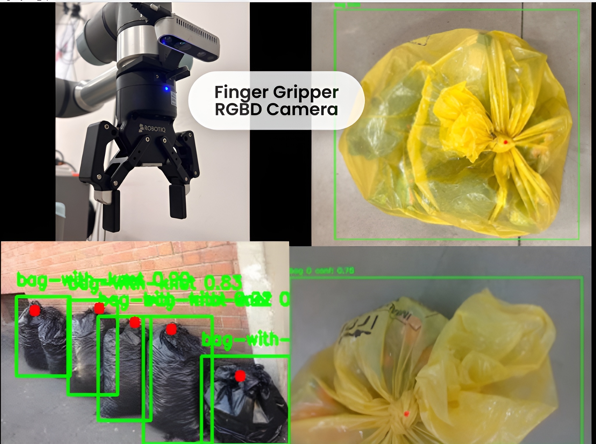
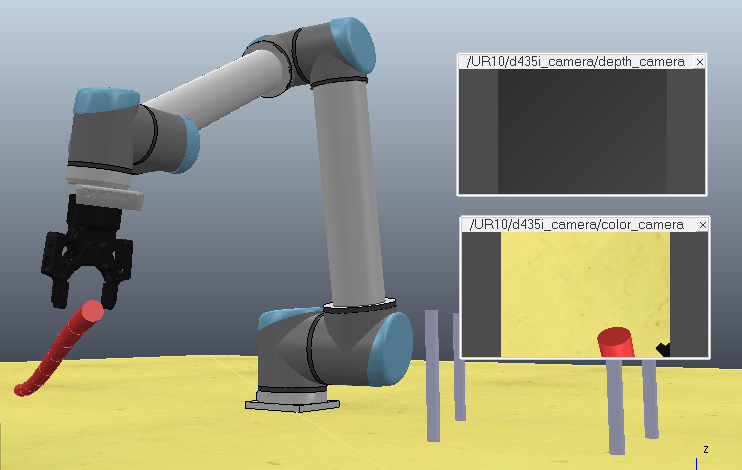
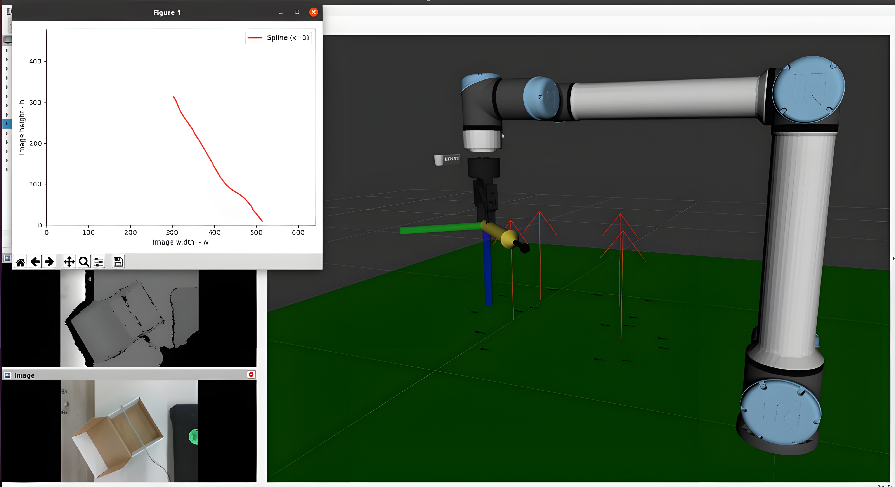
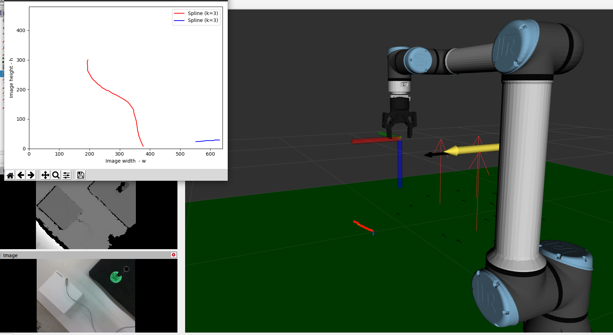

  <a class="button-link" href="../progetti.html">Tutti i progetti</a>
  <a class="button-link" href="../projects/deformable.html">English</a>

# Manipolazione di oggetti deformabili

Questa pagina raccoglie il mio lavoro sugli oggetti deformabili, dalle basi di percezione e grasping su cavi fino alla ricerca attuale su mobile manipulators e co-manipolazione. Le attività più recenti sono collegate al progetto SiMOD.

## Mobile manipulation di oggetti deformabili

  

### Overview

Nel progetto SiMOD lavoro su pipeline di percezione e manipolazione di oggetti deformabili con mobile manipulators.

Uno dei setup principali combina un UR5e montato su base mobile Neobotix MPO-500, con una Intel RealSense D435i installata in prossimità della pinza. Questo consente rilevamento del target, percezione dell'ambiente, grasp planning ed esecuzione anche in scenari parzialmente occlusi o poco strutturati.

### Mio ruolo

Questo lavoro software è principalmente mio, salvo modelli di percezione di terze parti esplicitamente citati dove necessario.

- Integrazione della pipeline di percezione e manipolazione
- Logica software per grasp ed esecuzione del task
- Test in simulazione e su piattaforma reale
- Estensione verso comportamenti di manipolazione fisicamente interattivi

### Focus tecnico

- Rilevamento e localizzazione di oggetti deformabili
- RGB-D perception per stima del target
- Grasping di sacchi e oggetti morbidi su superfici realistiche
- Manipolazione reattiva in presenza di vincoli di interazione
- Integrazione tra percezione, motion ed execution control

  
  
  

### Link pubblici collegati

  <a href="https://www.linkedin.com/posts/italo-almirante-62431a216_robotics-perception-research-activity-7386056647640571905-Z9xD">Post sulla manipolazione single-arm</a>
  <a href="https://www.linkedin.com/posts/italo-almirante-62431a216_mobile-manipulation-of-large-deformable-activity-7384270449653772288-xe9u">Post sulla co-manipolazione dual-arm</a>
  <a href="https://simod.eu/">Progetto SiMOD</a>

## Co-manipolazione e strategia di interazione

Un aspetto chiave di questa linea di ricerca è la co-manipolazione di grandi oggetti deformabili con più manipolatori.

La logica di controllo non consiste solo nel seguire una traiettoria condivisa. Un robot agisce da leader e decide autonomamente il moto di riferimento, mentre il secondo segue attraverso sensori di forza e un comportamento di controllo passivo basato sulla forza. Questo rende il sistema più tollerante all'incertezza nella deformazione dell'oggetto e nei vincoli di interazione.

## Basi percettive e di grasping sui DLO

  

### Overview

Questo lavoro nasce dal mio tirocinio e dalla mia tesi magistrale e ha posto le basi dei progetti successivi sulla manipulation.

Ho sviluppato una pipeline in ROS1 per la manipolazione di deformable linear objects, come cavi e corde, su superfici piane. Il workflow combina detection da immagine, ricostruzione 3D della posa, esecuzione del grasp e validazione sia in simulazione sia sul sistema reale.

### Cosa ho sviluppato

- Pipeline software completa in ROS1 per il workflow di manipolazione
- Integrazione tra percezione, stima 3D ed esecuzione del manipolatore
- Simulazione in CoppeliaSim per validare configurazioni di grasp
- Test reali di grasp su oggetti cable-like

### Sintesi del metodo

- Elaborazione di immagini RGB per il rilevamento dei DLO
- Ricostruzione della posa 3D tramite informazione stereo o depth
- Routine di grasp e spostamento di DLO su superficie piana
- Confronto sim-to-real tra comportamento modellato e fisico

  
  

  
  

### Nota sui modelli di percezione

Il modulo di segmentazione dei cavi si basava su metodi state-of-the-art per la percezione dei deformable linear objects e non su una rete di percezione sviluppata da me. Nel sito questa distinzione rimane esplicita.

### Riferimenti e link collegati

  <a href="https://lar-unibo.github.io/files/publications/FASTDLO_Fast_Deformable_Linear_Objects_Instance_Segmentation.pdf">Paper FASTDLO</a>
  <a href="https://mediatum.ub.tum.de/doc/1701469/v9sewlaprnb16nt77gnt2pn8r.10045806.pdf">Paper RT-DLO</a>

## Strumenti e piattaforme lungo questa linea di lavoro

- ROS1 e ROS2
- CoppeliaSim
- RGB-D perception
- Manipolatori Universal Robots
- Basi mobili e mobile manipulators
- Controllo di interazione basato sulla forza

---

## Links

  <a href="https://simod.eu/">SiMOD</a>

---

<a class="button-link" href="../progetti.html">Torna ai progetti</a>
