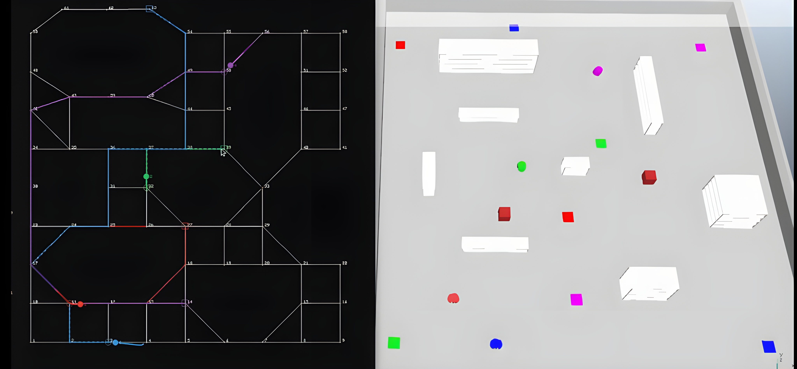
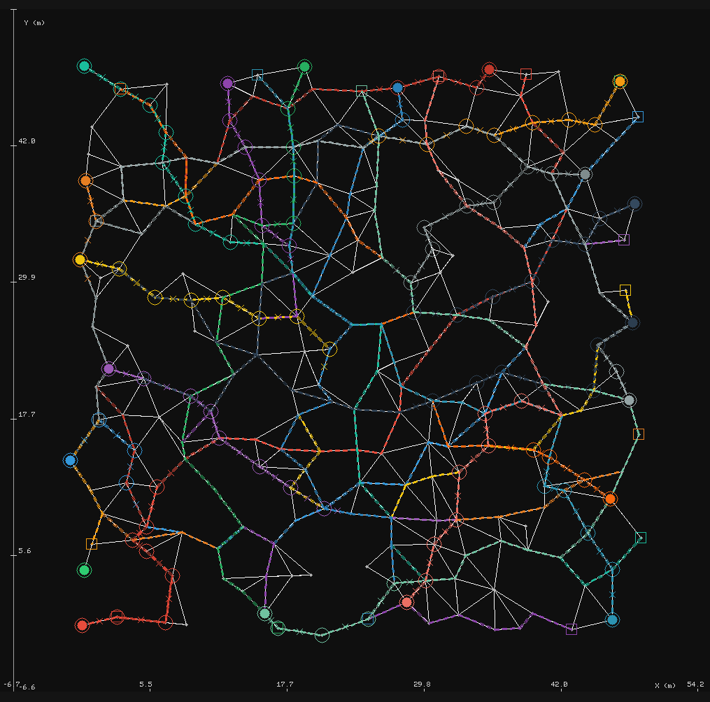

  <a class="button-link" href="../progetti.html">Tutti i progetti</a>
  <a class="button-link" href="../projects/mapf.html">English</a>

# Multi-Robot Planning for Dynamic Warehouses

  

## Overview

Questo progetto rappresenta la principale direzione di ricerca del mio PhD e si concentra sul coordinamento scalabile, robusto e flessibile di flotte robotiche in ambienti warehouse dinamici.

Ho progettato e sviluppato un framework completo in C++ integrato con ROS2 e CoppeliaSim, con supporto a strategie di pianificazione event-based e periodiche. L'obiettivo è studiare lifelong multi-robot path planning in condizioni operative realistiche, dove i goal cambiano online, i robot possono subire errori di esecuzione e l'ambiente non è statico.

## Mio ruolo

Questo lavoro è interamente mio sul piano della progettazione di sistema e dell'implementazione.

- Progettazione dell'architettura software
- Sviluppo del framework di simulazione e planning in C++
- Integrazione con ROS2 e CoppeliaSim
- Ricerca su MAPF, TAPF, robust replanning e decision making per la logistica
- Esplorazione di componenti di reinforcement learning per ottimizzazione e adattamento

## Elementi tecnici principali

- Simulazioni di flotte con oltre 250 robot
- Online planning sotto i 100 ms in scenari dinamici
- Modalità di replanning event-triggered e periodica
- Aggiornamento dinamico dei goal e replanning execution-aware
- Gestione di conflitti e ostacoli basata su priorità
- Struttura modulare per futura integrazione di layer decisionali learning-based

## Media

  
  

## Stack

- C++
- ROS2
- CoppeliaSim
- Multi-agent path finding
- Estensioni di task allocation
- Reinforcement learning per ottimizzazione logistica

---

<a class="button-link" href="../progetti.html">Torna ai progetti</a>
