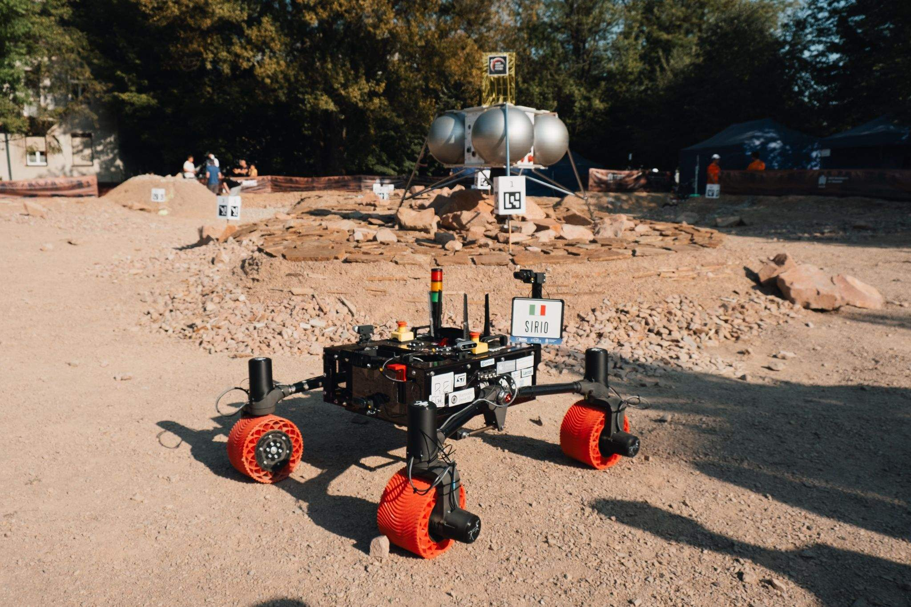
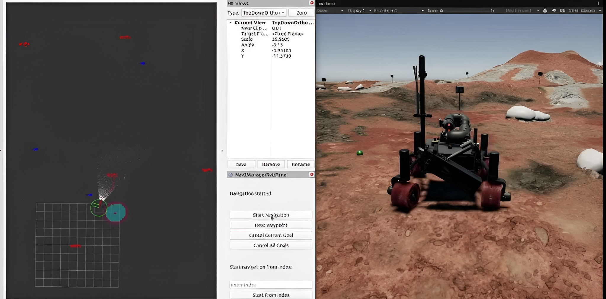
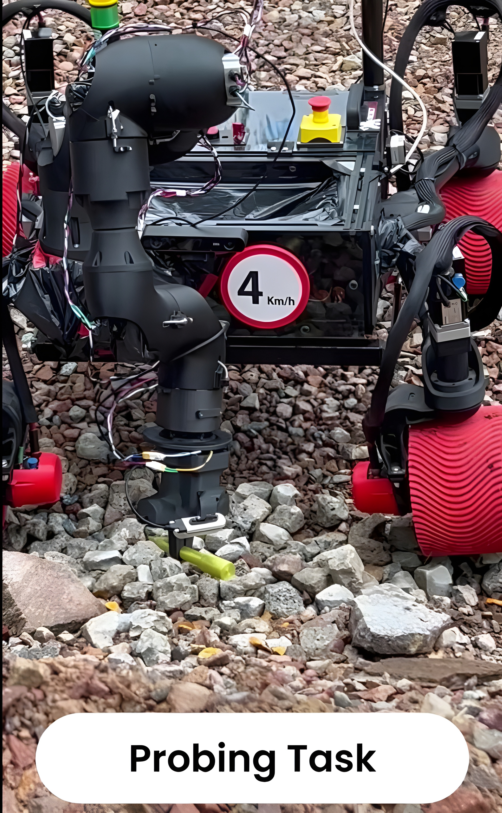

  <a class="button-link" href="../progetti.html">Tutti i progetti</a>
  <a class="button-link" href="../projects/rover.html">English</a>

# ProjectRED Rover

Questa pagina raccoglie il principale lavoro robotico che ho svolto in ProjectRED, includendo leadership tecnica e manageriale, supervisione dell'architettura software, navigazione autonoma, manipolazione rover e integrazione di sottosistemi.

## Storia in ProjectRED e leadership

  

  

Sono entrato in ProjectRED inizialmente come control software developer, poi ho ricoperto il ruolo di Project Manager e successivamente ho continuato come external advisor e robotics supervisor.

Il mio contributo copre sia l'esecuzione ingegneristica sia responsabilità di leadership.

### Ambito di leadership e coordinamento

- Leadership di un team eterogeneo
- Pianificazione, task allocation e supervisione tecnica delle attività software
- Esperienza di gestione budget durante l'anno in cui sono stato team leader
- Supporto alle decisioni di architettura software e all'integrazione dei sottosistemi negli anni successivi
- Coordinamento tra controllo, robotica e validazione a livello di sistema

### Storia competitiva rilevante rispetto al mio ruolo

- ERC 2022 Remote: 3° posto
- ERC 2023 Remote: 3° posto
- ERC 2023 On-Site: 9° posto, miglior risultato on-site di ProjectRED finora
- Budget del team durante il mio anno da Project Manager: oltre 60k euro
- Budget del team negli anni successivi: circa 30k euro

## Navigazione autonoma e digital twin

  

### Il progetto

Una parte importante del lavoro sul rover ha riguardato la navigazione autonoma dalla simulazione fino al deployment in campo.

Ho collaborato all'architettura di controllo autonomo del rover e ho supervisionato la costruzione di un digital twin ROS2 più Unity usato per validare i workflow di navigazione prima dei test reali.

### Contenuto tecnico

- Digital twin ad alta fedeltà in Unity più ROS2 per validazione e testing
- Stack di navigazione autonoma con gestione ostacoli in tempo reale
- Pipeline di localizzazione che combina wheel odometry, visual odometry e landmark-based estimation
- Verifiche di coerenza simulation-to-reality per il deployment in campo
- Integrazione senza Nav2 e logiche custom per obstacle filtering

  <a href="https://www.linkedin.com/posts/italo-almirante-62431a216_projectred-europeanroverchallenge-autonomousnavigation-activity-7388863699136094209-9TYG">Post sulla navigazione</a>

## Braccio rover, probing e deep sampling

### Il progetto

Ho inoltre collaborato al sottosistema del braccio robotico e all'integrazione delle funzionalità  orientate ai task scientifici.

Questo include controllo del manipolatore, esecuzione del grasping e teleoperazione remota per operazioni di precisione.

### Contenuto tecnico

- Routines e trajectory planning con MoveIt2
- Comunicazione motori orientata a CANopen e coordinamento dei sottosistemi
- Teleoperation remota per movimenti di precisione
- Detection e allineamento della provetta per approccio autonomo

  

Task di probing nel digital twin Unity.

  

Task di probing in ambiente reale.

### Sottosistema di drilling e sampling

La piattaforma rover includeva anche un sottosistema di drill e un workflow di deep sampling. Nel sito questo viene presentato come sottosistema collaborativo a cui ho contribuito all'interno di un contesto di team più ampio, e non come progetto individuale autonomo.

  <a href="https://www.linkedin.com/posts/italo-almirante-62431a216_projectred-europeanroverchallenge-robotics-ugcPost-7393605155243495425-uCqN">Post sul braccio rover</a>
  <a href="https://www.linkedin.com/feed/update/urn:li:activity:7399105184318009344/">Post sul drilling system</a>

## Certificati e riferimenti pubblici

  <a href="https://spacecert.org/certificate/25NBF9E2/">Certificato ERC 2025</a>
  <a href="https://roverchallenge.eu/certificate/projectred-italo-almirante-erc2024-on-site/">Certificato ERC 2024 on-site</a>
  <a href="https://roverchallenge.eu/certificate/2023-onsite-projectred-italo-almirante/">Certificato ERC 2023 on-site</a>
  <a href="https://roverchallenge.eu/certificate/2023-remote-projectred-italo-almirante/">Certificato ERC 2023 remote</a>
  <!-- <a href="https://projectred.it/">ProjectRED</a> -->
  <a href="https://www.dismi.unimore.it/it/didattica/progetti-gli-studenti/project-red">ProjectRED</a>

## Nota sull'ownership

ProjectRED è, per sua natura, un lavoro di team multidisciplinare. Questa pagina riflette il mio ruolo reale: contributo diretto forte alle attività di robotica e controllo, responsabilità di leadership e coordinamento, e supervisione dell'architettura software e dell'integrazione, senza presentare il rover come un progetto esclusivamente individuale.

---

<a class="button-link" href="../progetti.html">Torna ai progetti</a>
